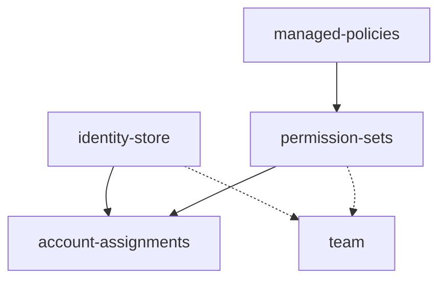

# AWS Identity Management

Terraform configurations for AWS IAM Identity Center (formerly AWS SSO). This repository manages users, groups, permission sets, and account assignments through Infrastructure as Code.

## Overview

This repository works bidirectionally with a generator tool:

1. **You make changes** - Edit permission sets, policies, or assignments directly in this repo
2. **Changes are reviewed and merged** - Standard PR workflow
3. **Terraform applies changes** - Terraform Cloud deploys to AWS
4. **Generator refreshes** - The generator runs to import any AWS-side changes and reformat the codebase

This approach gives you the benefits of IaC (version control, review, audit trail) while accommodating changes from multiple sources (SCIM, AWS console, break-glass scenarios).

## Repository Structure

```
├── identity_store/        # Users, groups, and group memberships
├── managed_policies/      # AWS managed policy references
│   └── policies/          # Policy document cache
├── permission_sets/       # Permission sets with inline and managed policies
│   └── inline_policies/   # Custom IAM policy documents
├── account_assignments/   # User/group assignments to AWS accounts
└── team/                  # AWS TEAM resources (if enabled)
```

This repository uses **maps** with human-readable keys (like `"alice@example.com"`) to make configurations easy to read and modify. See [Maps and Flatteners](#maps-and-flatteners) for technical details.

---

## Identity Store

The `identity_store/` directory manages users, groups, and group memberships. How you interact with these resources depends on whether SCIM provisioning is enabled.

### With SCIM Enabled (Entra ID, Okta, etc.)

When SCIM is enabled, users and groups are synced from your identity provider. These are referenced as **data sources** in Terraform - they're read-only references to IdP-managed identities that cannot be modified here.

```hcl
# SCIM-managed user - read-only data source
data "aws_identitystore_user" "alice_example_com" {
  identity_store_id = local.sso_instance_identity_store_id

  alternate_identifier {
    unique_attribute {
      attribute_path  = "UserName"
      attribute_value = "alice@example.com"
    }
  }
}
```

The maps unify both SCIM and local resources under the same interface:

```hcl
locals {
  users_map = {
    # SCIM user - references data source
    "alice@example.com" = data.aws_identitystore_user.alice_example_com.user_id,
    # Local user - references resource
    "aws+production@example.com" = aws_identitystore_user.aws_production_example_com.user_id
  }
}
```

### Local Users and Groups

Even with SCIM enabled, you can create "local" users and groups directly in IAM Identity Center. These are managed as Terraform resources and won't be overwritten by SCIM.

Local users cannot log in when SAML authentication is enabled - they exist for specific infrastructure purposes:

1. **Account Factory Users** - Auto-created by AWS Control Tower Account Factory (e.g., `aws+account-name@example.com`). These are the base Identity Center user for new accounts.

2. **Provisioner Users** - Created to keep permission set roles provisioned on accounts. This solves a problem with services like EKS that require stable role ARNs.

   **The EKS Problem**: When using AWS TEAM (Temporary Elevated Access Management), permission sets are only provisioned to an account while a grant is active. Once the grant expires, the underlying IAM role is deleted. If the permission set is later re-provisioned, it gets a new role ARN. Services like EKS that reference the role ARN in their auth config will break.

   **The Solution**: Create a local "provisioner" user and permanently assign the permission set to that user on the target accounts. This keeps the underlying IAM role in place with a stable ARN, even when no real users have active TEAM grants.

### Group Memberships

Group memberships are managed via a map structure:

```hcl
locals {
  group_memberships_map = {
    "GlobalAdministrators" = [
      "alice@example.com",
      "bob@example.com"
    ],
    "Developers" = [
      "alice@example.com",
      "charlie@example.com"
    ]
  }
}
```

For SCIM groups, memberships are read-only and stored in a separate `group_memberships_map_scim` local.

### Without SCIM (Built-in Identity Management)

If you're using IAM Identity Center's built-in identity store (no external IdP), all users, groups, and memberships can be fully managed through this repository as Terraform resources.

---

## Managed Policies

The `managed_policies/` directory contains references to AWS managed IAM policies. These are used by permission sets to attach standard AWS policies.

### Policy References

AWS managed policies are referenced as data sources:

```hcl
data "aws_iam_policy" "managed_policies" {
  for_each = toset(local.managed_policies_list)
  name     = each.value
}
```

### Managed Policies Map

The map provides easy lookup of policy ARNs by name:

```hcl
locals {
  managed_policies_map = {
    "AdministratorAccess" = data.aws_iam_policy.managed_policies["AdministratorAccess"].arn,
    "PowerUserAccess" = data.aws_iam_policy.managed_policies["PowerUserAccess"].arn,
    "ViewOnlyAccess" = data.aws_iam_policy.managed_policies["ViewOnlyAccess"].arn
  }
}
```

### Policy Document Cache

The `managed_policies/policies/` directory contains cached copies of AWS managed policy documents. These are for reference only - the actual policies are fetched from AWS at runtime.

---

## Permission Sets

The `permission_sets/` directory defines what level of access users/groups receive when assigned to an account. Permission sets consist of:

- **Session Duration** - How long credentials are valid (ISO 8601 format, e.g., `PT8H` for 8 hours)
- **Managed Policies** - AWS-managed or customer-managed IAM policies to attach
- **Inline Policies** - Custom IAM policy documents specific to this permission set

### Permission Set Resources

```hcl
resource "aws_ssoadmin_permission_set" "AdministratorAccess" {
  instance_arn     = local.sso_instance_arn
  name             = "AdministratorAccess"
  description      = "Full administrator access"
  session_duration = "PT1H"
}
```

### Permission Sets Map

The map provides easy lookup of permission set ARNs by name:

```hcl
locals {
  permission_sets_map = {
    "AdministratorAccess" = aws_ssoadmin_permission_set.AdministratorAccess.arn,
    "DeveloperAccess" = aws_ssoadmin_permission_set.DeveloperAccess.arn,
    "ReadOnlyAccess" = aws_ssoadmin_permission_set.ReadOnlyAccess.arn
  }
}
```

### Managed Policy Attachments

The managed policy attachments map shows which AWS managed policies are attached to each permission set:

```hcl
locals {
  permission_set_managed_policy_attachments_map = {
    "AdministratorAccess" = [
      "AdministratorAccess",
      "Billing"
    ],
    "DeveloperAccess" = [
      "PowerUserAccess"
    ],
    "ReadOnlyAccess" = [
      "ViewOnlyAccess"
    ]
  }
}
```

### Inline Policies

Each permission set can have at most **one inline policy**. The policy file must be named `<PermissionSetName>.json` to match the permission set it belongs to.

Custom policies are stored as JSON files in `permission_sets/inline_policies/`:

```json
// permission_sets/inline_policies/CustomDeveloper.json
{
  "Version": "2012-10-17",
  "Statement": [
    {
      "Effect": "Allow",
      "Action": ["s3:GetObject", "s3:PutObject"],
      "Resource": "arn:aws:s3:::dev-*/*"
    }
  ]
}
```

### TEAM Permission Sets

Permission sets prefixed with `TEAM-` are used for temporary elevated access through AWS TEAM. These are excluded from the standard account assignments map since they're assigned dynamically through the TEAM approval workflow.

```hcl
resource "aws_ssoadmin_permission_set" "TEAM-S3FullAccess" {
  instance_arn     = local.sso_instance_arn
  name             = "TEAM-S3FullAccess"
  session_duration = "PT1H"
}
```

---

## Account Assignments

The `account_assignments/` directory connects the dots between **who** (users/groups), **what** (permission sets), and **where** (AWS accounts).

### The Assignments Map

The map structure makes it easy to see and modify access:

```hcl
locals {
  account_assignments_map = {
    "Production" = {
      "AdministratorAccess" = {
        "GROUP" = ["GlobalAdministrators"]
      },
      "ReadOnlyAccess" = {
        "GROUP" = ["Developers", "SecurityAuditors"],
        "USER" = ["alice@example.com"]
      }
    },
    "Development" = {
      "AdministratorAccess" = {
        "GROUP" = ["GlobalAdministrators"]
      },
      "DeveloperAccess" = {
        "GROUP" = ["Developers"]
      }
    }
  }
}
```

Reading this: "On the Production account, the GlobalAdministrators group has AdministratorAccess, and both Developers/SecurityAuditors groups and alice@example.com have ReadOnlyAccess."

### Adding an Assignment

To grant access, add an entry to the appropriate location in the map:

```hcl
# Grant DeveloperAccess to the Developers group on the Staging account
"Staging" = {
  "DeveloperAccess" = {
    "GROUP" = ["Developers"]
  }
}
```

### Account and OU Reference Maps

The `team/locals.tf` file includes reference maps for accounts and OUs:

```hcl
locals {
  account_map = {
    "Production" = "111111111111",
    "Staging" = "222222222222",
    "Development" = "333333333333",
    "Log Archive" = "444444444444"
  }

  ou_map = {
    "Root" = "r-xxxx",
    "Root/Security" = "ou-xxxx-aaaaaaaa",
    "Root/Workloads" = "ou-xxxx-bbbbbbbb",
    "Root/Workloads/Production" = "ou-xxxx-cccccccc",
    "Root/Workloads/Development" = "ou-xxxx-dddddddd"
  }
}
```

---

## AWS TEAM (Temporary Elevated Access Management)

The `team/` directory manages AWS TEAM, which provides just-in-time, approval-based temporary access to AWS accounts.

### How TEAM Works

1. **User requests access** - Selects account, permission set, and duration
2. **Approval workflow** - Designated approvers review and approve/deny
3. **Temporary grant** - Permission set is provisioned to the account for the user
4. **Automatic revocation** - Access is removed when the grant expires

### Eligibility Policies

Eligibility policies define who can request what access:

```hcl
module "eligibility___User___alice_example_com" {
  source           = "./modules/eligibility"
  environment_data = local.eligibility_environment_data

  entity_type  = "User"
  entity_value = "alice@example.com"

  max_duration      = "8"        # Maximum hours
  approval_required = true

  ou_names = [
    "Production",
    "Development"
  ]

  account_names = []  # Empty = all accounts in the OUs above

  permission_sets = [
    "TEAM-S3FullAccess",
    "TEAM-DatabaseAccess"
  ]
}
```

This policy allows `alice@example.com` to request `TEAM-S3FullAccess` or `TEAM-DatabaseAccess` on any account in the Production or Development OUs, for up to 8 hours, with approval required.

### Approver Policies

Approver policies define who can approve requests for specific scopes:

```hcl
module "approvers___OU___Production" {
  source           = "./modules/approver"
  environment_data = local.approver_environment_data

  entity_type  = "OU"
  entity_value = "Production"

  approvers = [
    "TEAM-Admins",
    "GlobalAdministrators"
  ]
}
```

This policy allows members of `TEAM-Admins` or `GlobalAdministrators` groups to approve requests for any account in the Production OU.

### TEAM Permission Set Naming

By convention, TEAM permission sets are prefixed with `TEAM-` to distinguish them from permanent assignments. These are excluded from the standard `account_assignments_map` since they're assigned dynamically.

### Importing Existing TEAM Policies

Importing existing approver and eligibility policies is **not supported** because Terraform cannot import `dynamodb_table_item` resources. To bring existing policies under Terraform management:

1. Run the generator to create the Terraform configuration from existing policies
2. Temporarily delete the policies from the TEAM console
3. Run `terraform apply` to recreate them under Terraform management

This is a one-time migration step for existing TEAM deployments.

---

## Terraform Cloud Workspaces

| Workspace | Purpose | Dependencies |
|-----------|---------|--------------|
| `identity-store` | Users, groups, memberships | None |
| `managed-policies` | AWS managed policy references | None |
| `permission-sets` | Permission sets and policies | managed-policies |
| `account-assignments` | Account assignments | identity-store, permission-sets |
| `team` | AWS TEAM (if enabled) | None (see note) |

### Workspace Dependencies



Solid lines indicate remote state dependencies (workspace outputs). Dotted lines indicate that `team` doesn't use remote state, but references resources (users, groups, permission sets) that must exist in AWS before applying.

### Deployment Order

Apply in order: `identity-store` → `managed-policies` → `permission-sets` → `account-assignments`

The `team` workspace fetches users, groups, and permission sets directly from AWS rather than using remote state. It can be applied independently, but the resources it references must already exist in AWS.

---

## Making Changes

### Standard Change Process

1. Create a branch and make your changes
2. Open a pull request for review
3. After approval, merge to main
4. Terraform Cloud automatically plans and applies changes
5. The generator runs on schedule (or manually) to refresh the codebase

### Generator Refresh

The generator runs periodically to:
- Import any resources created outside Terraform (AWS console, SCIM, etc.)
- Reformat code to maintain consistency
- Update import blocks for new resources
- Sync managed policy references

Your changes are preserved - the generator merges AWS state with existing Terraform code.

---

## Common Tasks

### Adding New Resources

When adding net-new resources, you must also add corresponding map entries. The following resource types require map updates:

| Resource Type | Map to Update | Used By |
|--------------|---------------|---------|
| Permission Set | `permission_sets_map` | Inline policies, managed policy attachments, account assignments |
| User (local) | `users_map` | Group memberships, account assignments |
| Group (local) | `groups_map` | Group memberships, account assignments |

Account assignments and group memberships don't require separate map entries - they're derived from the maps above.

### Add a New Permission Set

1. Add the permission set resource in `permission_sets/aws_ssoadmin_permission_sets.tf`
2. Add managed policy attachments in `permission_sets/aws_ssoadmin_managed_policy_attachments_map.tf`
3. Optionally add inline policy JSON in `permission_sets/inline_policies/`
4. Create PR, merge, and let Terraform apply

### Assign Permission Set to Account

Add the assignment to `account_assignments/aws_ssoadmin_account_assignments_map.tf`:

```hcl
"MyAccount" = {
  "MyPermissionSet" = {
    "GROUP" = ["MyGroup"]
  }
}
```

### Modify Session Duration

Edit the `session_duration` attribute on the permission set (ISO 8601 duration format):

```hcl
resource "aws_ssoadmin_permission_set" "DeveloperAccess" {
  # ...
  session_duration = "PT12H"  # 12 hours
}
```

### Add TEAM Eligibility

Add a new eligibility module in `team/aws_team_eligibility_policies.tf`:

```hcl
module "eligibility___Group___Developers" {
  source           = "./modules/eligibility"
  environment_data = local.eligibility_environment_data

  entity_type  = "Group"
  entity_value = "Developers"

  max_duration      = "4"
  approval_required = true

  ou_names      = ["Development"]
  account_names = []
  permission_sets = ["TEAM-DeveloperAccess"]
}
```

---

## Troubleshooting

### "Resource already exists" on apply

The resource exists in AWS but not in Terraform state. Options:
1. Wait for the generator to run - it will create import blocks
2. Manually import: `terraform import aws_ssoadmin_permission_set.name <arn>`

### Changes reverted after generator runs

The generator preserves your Terraform changes. If changes are reverted:
1. Check if the change was made in AWS console (generator imports AWS state)
2. Ensure your change was merged before the generator ran
3. Contact the administrator if the issue persists

### Workspace dependency errors

Apply workspaces in the correct order. The `permission-sets` workspace depends on `identity-store` and `managed-policies` outputs.

---

## Security

It is strongly recommended to deploy this configuration from an **IAM Identity Center delegated administrator account** rather than the management account. This follows AWS security best practices by limiting access to the management account.

**Important limitation**: A delegated administrator account cannot modify permission sets or account assignments that have been provisioned to the management account. Any access to the management account must be configured directly from the management account itself.

Additional security measures:
- No secrets or credentials are stored in this repository
- Terraform Cloud uses OIDC for AWS authentication
- All changes are tracked in Git history
- Pull requests require review before merging

---

## Maps and Flatteners

This repository makes heavy use of **maps** and **flatteners** to represent complex relationships cleanly. This pattern provides several benefits:

- **Human-readable keys** - Maps use original names like `"alice@example.com"`
- **Easy lookups** - Find a user's ID, group's ID, or permission set ARN by name
- **Declarative relationships** - Define who has access to what in a readable structure
- **Automatic expansion** - Flatteners convert nested maps into flat lists for `for_each`

### Example: Users Map

```hcl
locals {
  users_map = {
    "alice@example.com" = data.aws_identitystore_user.alice_example_com.user_id,
    "bob@example.com" = aws_identitystore_user.bob_example_com.user_id,
    "aws+production@example.com" = aws_identitystore_user.aws_production_example_com.user_id
  }
}
```

Note: SCIM-provisioned users reference `data` sources (read-only), while local users reference `resource` blocks.

### Example: Account Assignments Map

```hcl
locals {
  account_assignments_map = {
    "Production" = {
      "AdministratorAccess" = {
        "GROUP" = ["GlobalAdministrators"],
        "USER" = ["alice@example.com"]
      },
      "ReadOnlyAccess" = {
        "GROUP" = ["SecurityAuditors"]
      }
    }
  }
}
```

This nested structure is then flattened for the `for_each`:

```hcl
locals {
  account_assignments_flattened = flatten([
    for account_name, permissions in local.account_assignments_map : [
      for permission_set, principals in permissions : [
        for principal_type, principal_list in principals : [
          for principal in principal_list : {
            principal_type = principal_type
            principal      = principal
            account_name   = account_name
            permission_set = permission_set
          }
        ]
      ]
    ]
  ])
}
```

## License

This project is licensed under the GNU General Public License v3.0 - see the [LICENSE](LICENSE) file for details.
